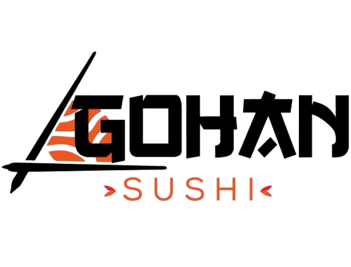
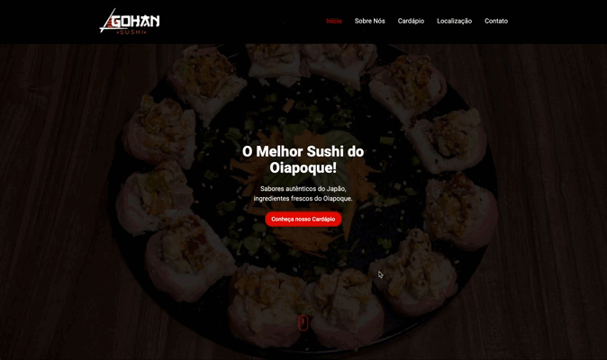

# 🍣 Gohan Sushi

<div align="center">
  
  
  <p>Experimente o verdadeiro sabor da culinária japonesa com um toque amazônico!</p>
</div>

---

## 📋 Visão Geral do Projeto

O **Gohan Sushi** é um site responsivo e moderno. O projeto apresenta uma experiência gastronômica única que combina técnicas tradicionais japonesas com ingredientes frescos da região amazônica.

O site oferece uma interface elegante e interativa para apresentar o cardápio, informações sobre o empreendimento, localização e canais de contato, proporcionando aos clientes uma experiência digital que reflete a qualidade e tradição do estabelecimento.

## 🎨 Tecnologias Utilizadas

### Front-end

-   **React** - Biblioteca JavaScript para construção de interfaces
-   **TypeScript** - Superset do JavaScript com tipagem estática
-   **Vite** - Build tool e dev server ultrarrápido
-   **Tailwind CSS** - Framework CSS utility-first para estilização
-   **React Router DOM** - Roteamento para aplicações React

### Bibliotecas e Componentes

-   **Framer Motion** - Animações e transições fluidas
-   **Swiper** - Carrossel/slider responsivo e touch-friendly
-   **Radix UI** - Componentes acessíveis e personalizáveis
-   **Lucide React** - Ícones modernos e minimalistas
-   **Hamburger React** - Menu hamburger animado

## ⚙️ Instalação e Configuração

### 🛠️ Pré-requisitos

Certifique-se de ter instalado em sua máquina:

-   **Node.js** instalado na máquina - versão v20.18.1 ou superior
-   **NPM** (Node Package Manager) para instalar as dependências necessárias do projeto.

### 🛠️ Preparação do ambiente

-   Clone o repositório, com o comando abaixo, no seu terminal:

    -   Utilizando HTTPS `https://github.com/wiltonmartinsdev/gohan-sushi.git` ou
    -   Utilizando SSH: `git@github.com:wiltonmartinsdev/gohan-sushi.git`.

-   No seu editor de preferência acesse o diretório do projeto e entre na pasta Web com o comando: `cd Web`.
-   Certifique-se de ter o Node.js e o NPM instalados em sua máquina e depois digite no terminal o comando abaixo para instalar todas as dependências necessárias do projeto.

        npm install

## 🚀 Como Executar

-   Após instalar todas as dependências necessárias do projeto, agora poderá executá-lo da seguinte maneira:
-   Digite no terminal o comando abaixo:

    ```bash
        npm run dev
    ```

Após esse comando, o servidor de desenvolvimento será iniciado e estará disponível em:

-   **Local**: `http://localhost:3000`
-   **Rede**: `http://[seu-ip]:3000` (acessível por outros dispositivos na mesma rede)

## 🎬 Veja em Ação

<p align="center">
  
</p>

<p align="center">
  <i>Demonstração das principais funcionalidades do Gohan sushi</i>
</p>

## ✨ Funcionalidades

### 🏠 Página Principal

-   **Hero Section**: Carrossel principal com imagens atrativas
-   **Seção Sobre**: Apresentação do restaurante com efeito parallax
-   **Preview do Cardápio**: Carrossel com destaques do menu
-   **Localização**: Mapa interativo e informações de endereço
-   **Contato**: Links para redes sociais e WhatsApp

### 📱 Responsividade Completa

-   Design otimizado para **desktop**, **tablet** e **mobile**
-   Menu hamburger para dispositivos móveis
-   Navegação touch-friendly
-   Imagens adaptáveis e carregamento otimizado

### 🎨 Interface e Experiência

-   **Efeitos Parallax**: Criando profundidade visual
-   **Animações Fluidas**: Usando Framer Motion
-   **Carrosséis Interativos**: Navegação suave com Swiper
-   **Design System**: Componentes consistentes e reutilizáveis

### 🍱 Cardápio Interativo

-   **Página dedicada**: Cardápio completo com filtros por categoria
-   **Cards informativos**: Cada prato com imagem, descrição e preço
-   **Busca e filtros**: Facilita a navegação pelo menu
-   **Destaques**: Pratos populares em evidência

### 🌐 Navegação Inteligente

-   **Single Page Application (SPA)**: Navegação sem recarregamento
-   **Hash Navigation**: Links diretos para seções específicas
-   **Breadcrumbs**: Navegação contextual
-   **Smooth Scroll**: Rolagem suave entre seções

### 🔗 Integração com Redes Sociais

-   **WhatsApp Business**: Link direto para pedidos
-   **Facebook**: Página oficial do estabelecimento
-   **Instagram**: Perfil com fotos dos pratos
-   **Google Maps**: Localização exata integrada

### 🎯 SEO e Performance

-   **Meta tags otimizadas**: Melhora o ranking nos buscadores
-   **Lazy loading**: Carregamento otimizado de imagens
-   **Compressão de assets**: Build otimizado para produção
-   **Lighthouse Score**: Performance otimizada

## 📊 Status do Projeto

-   🟢 **Front-end**: Completo e production-ready
-   🟡 **Back-end**: Em desenvolvimento futuro
-   🚀 O projeto está aberto para melhorias e novas funcionalidades podem ser adicionadas no futuro.

## 📄 Licença

Este projeto está sob a licença MIT. Veja o arquivo [LICENSE](LICENSE) para mais detalhes.

[](https://opensource.org/licenses/MIT)

  <p> Se você gostou do projeto, não esqueça de dar uma estrela! ⭐</p>
